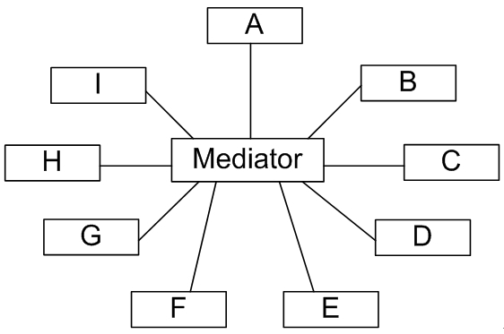

### 模式的说明
> symfony EventDispatcher组件是用[中介者模式](https://blog.csdn.net/lovelion/article/details/8482952)来实现的. 中介者模式的核心概念是，引入一个“第三者”来降低现有系统中类之间的耦合度,由这个“第三者”来封装并协调原有组件两两之间复杂的引用关系，使之成为一个松耦合的系统，这个“第三者”又称为“中介者”.



### 简单版的事件处理机制
> 分析symfony事件调度器之前，我们用中介者模式来实现一个简单版本的事件处理机制.

```php
class Mediator {
    protected $events = array();
    public function attach($eventName, $callback) {
        if (!isset($this->events[$eventName])) {
            $this->events[$eventName] = array();
        }
        $this->events[$eventName][] = $callback;
    }
    public function trigger($eventName, $data = null) {
        foreach ($this->events[$eventName] as $callback) {
            $callback($eventName, $data);
        }
    }
}
$mediator = new Mediator;
$mediator->attach('load', function() { echo "Loading"; });
$mediator->attach('stop', function() { echo "Stopping"; });
$mediator->attach('stop', function() { echo "Stopped"; });
$mediator->trigger('load'); // prints "Loading"
$mediator->trigger('stop'); // prints "StoppingStopped"
// 对象就可以保存在某个对象内部，来触发事件发生，或者被调用触发
```
Mediator是一个中介者类,attach方法用来存入事件监听者,当事件发生的时候,使用trigger来通知监听者.`$mediator`对象可以放在适合触发的业务对象内部,事件发送时调用trigger触发.

### Symfony的事件调度系统简单应用
使用composer进行安装 ```composer require symfony/event-dispatcher```

结合业务类进行使用
```php
class OrderCount
{
    public function onAdd(Event $event, $eventName, EventDispatcher $dispatcher)
    {
        echo '新增一个订单了,加入统计系统.';
    }
}

class OrderNewEvent extends Event
{
    public function __construct(Order $order)
    {

    }

    public const name = 'order.new'; // 新增订单事件
}

class Order
{
    private $dispatcher;
    private $no;

    // 新增一个订单
    public function create()
    {
        $this->dispatcher->dispatch(OrderNewEvent::name, new OrderNewEvent($this));
    }

    public function setDispatcher(EventDispatcher $dispatcher)
    {
        $this->dispatcher = $dispatcher;
    }
}

// 声明一个事件调度器(中介者)
$dispatcher = new EventDispatcher();
// 把同事类声明为回调类型，加入到中介者中
$dispatcher->addListener(OrderNewEvent::name, [new OrderCount(), 'onAdd']);

$order = new Order();
$order->setDispatcher($dispatcher);
$order->create();
```
